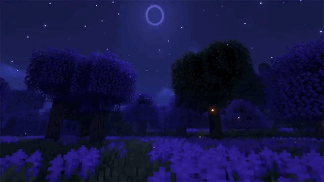

  
   
  

<h1 align="center">Hi, I'm Grovymon 👋</h1>

  developer, mod author, and professional breaker of things that worked perfectly five minutes ago.

## About Me

I build who-knows-what—mostly tools and optimizations that solve problems I have run into myself.

- I enjoy digging into Minecraft internals and modding APIs.
- I work with Fabric, NeoForge, Java, and Gradle.
- I like building tools that I would genuinely use myself.
- Occasionally, everything even works on the first try.

## Community

💬 **[Join the Discord server](https://discord.gg/gUPsQCnTeN)**

## What I'm Working On

- Improving [Create: Give Me FPS](https://github.com/Grovymon/Create-Give-Me-FPS), a set of client-side Create performance controls for NeoForge.
- Developing [Simple World Sync](https://github.com/Grovymon/simple-world-sync), a convenient way to synchronize Minecraft single-player worlds.
- Experimenting with an [Actions & Stuff](https://github.com/Grovymon/Actions-Stuff-port-Java) port for Minecraft Java Edition.

## Tech Stack

  
  
  
  
  
  
  

## Featured Projects

| Project | Description |
| --- | --- |
| [Create: Give Me FPS](https://github.com/Grovymon/Create-Give-Me-FPS) | Client-side Create performance controls and an accelerated renderer for NeoForge 1.21.1. |
| [Simple World Sync](https://github.com/Grovymon/simple-world-sync) | Synchronizes single-player worlds through a local folder, NAS, or cloud-drive sync. |
| [Actions & Stuff — Java Port](https://github.com/Grovymon/Actions-Stuff-port-Java) | An experimental Fabric port featuring Bedrock geometry, animations, controllers, and Molang. |

## GitHub Activity

  
  
   
  
   
  

  If the code looks weird, it was probably intentional.

---

## 🇷🇺 Русская версия

<strong>Открыть профиль на русском языке</strong>

### Привет, я Grovymon 👋

разработчик, автор модов и профессиональный ломатель вещей, которые ещё пять минут назад прекрасно работали.

#### Обо мне

Я занимаюсь разработкой херь пойми чего — в основном инструментов и оптимизаций, которые решают проблемы, с которыми я столкнулся сам.

- Люблю разбираться во внутренностях Minecraft и API для моддинга.
- Работаю с Fabric, NeoForge, Java и Gradle.
- Делаю инструменты, которыми действительно хочется пользоваться самому.
- Иногда всё даже работает с первого раза.

#### Сообщество

💬 **[Присоединиться к Discord-серверу](https://discord.gg/gUPsQCnTeN)**

#### Над чем я сейчас работаю

- Развиваю [Create: Give Me FPS](https://github.com/Grovymon/Create-Give-Me-FPS) — клиентские настройки производительности Create для NeoForge.
- Делаю [Simple World Sync](https://github.com/Grovymon/simple-world-sync) — удобную синхронизацию одиночных миров Minecraft.
- Экспериментирую с переносом [Actions & Stuff](https://github.com/Grovymon/Actions-Stuff-port-Java) на Minecraft Java Edition.

#### Технологии

Java · Fabric · NeoForge · Gradle · Git · GitHub · Minecraft

#### Избранные проекты

| Проект | Описание |
| --- | --- |
| [Create: Give Me FPS](https://github.com/Grovymon/Create-Give-Me-FPS) | Клиентские настройки производительности Create и ускоренный рендерер для NeoForge 1.21.1. |
| [Simple World Sync](https://github.com/Grovymon/simple-world-sync) | Синхронизация одиночных миров через локальную папку, NAS или облачный диск. |
| [Actions & Stuff — Java Port](https://github.com/Grovymon/Actions-Stuff-port-Java) | Экспериментальный Fabric-порт с Bedrock-геометрией, анимациями, контроллерами и Molang. |

